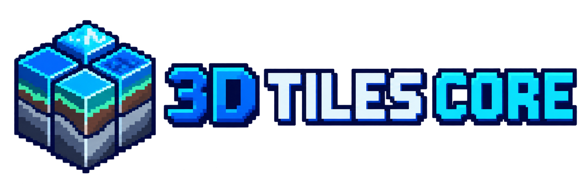

[](https://github.com/pandaGaume/3d-tiles-core/actions/workflows/ci-node.yml)
[](LICENSE)

<p align="center">
  
</p>

# 3D Tiles Core

`3d-tiles-core` provides implementation-neutral building blocks for OGC 3D Tiles.

The repository is organized by target language so the same contracts can later be implemented for Node.js, .NET and C++ or Unreal Engine without coupling the standard model to a rendering engine.

## Repository layout

```text
node/packages/core/  TypeScript interfaces, codecs and validation
node/packages/runtime/ Renderer-neutral traversal, loading and presentation lifecycle
node/packages/tiles/ Web tile addressing, HTTP tile sources and DEM codecs (XYZ, TMS, quadkey, Terrarium)
node/examples/babylon-google-3d-tiles/ Babylon.js and Google Photorealistic 3D Tiles example
node/examples/babylon-implicit-geodesic-grid/ Renderer-neutral pipeline proof with ellipsoid-projected Babylon grids
conformance/         Shared positive and negative conformance fixtures, including SPACEXR_bounding_volume_utm
dotnet/              Reserved for the future .NET implementation
cpp/                 Reserved for the future C++ and Unreal implementation
docs/                Cross-language architecture and compatibility rules
assets/brand/         Project logo and icon
```

The core package deliberately excludes rendering and streaming state. The runtime package builds mutable traversal nodes around those immutable contracts and delegates every host-specific operation to an adaptation layer.

Ellipsoid, geodetic, ECEF and local tangent frame mathematics live in the independent [`@spacexr/geodesy`](https://github.com/pandaGaume/geodesy_ts) package. The runtime consumes that numerical foundation through `EcefSpatialMetric` and keeps 3D Tiles-specific visibility and level-of-detail policy in this repository.

## Node.js development

Open the multi-root workspace to work on 3D Tiles Core, its runtime and the adjacent geodesy package together:

```powershell
code .\3d-tiles-core.code-workspace
```

`Ctrl+Shift+B` runs the default `3D Tiles: build` task from the correct `node` workspace. The VS Code task palette also provides install, test, check, runtime watch and geodesy documentation tasks.

```bash
cd node
npm ci
npm run check
```

The Node workspace publishes `@spacexr/3d-tiles-core`, `@spacexr/tiles` and `@spacexr/3d-tiles-runtime` under the `pandaGaume` GitHub organization. `@spacexr/tiles` is independent of 3D Tiles; the runtime depends on it to expose web map and DEM pyramids as implicit tilesets.

## Babylon.js example

The first renderer integration uses Babylon.js 9 with its native `GeospatialCamera`, large-world rendering and Google Photorealistic 3D Tiles. Its Google Map Tiles API key is read from an untracked `.env` file and is never embedded in repository source files.

See [Babylon.js and Google Photorealistic 3D Tiles](node/examples/babylon-google-3d-tiles/README.md) for Google Cloud setup, attribution requirements and local execution.

The [implicit geodesic grid example](node/examples/babylon-implicit-geodesic-grid/README.md) demonstrates the split activation and presentation pipeline without an API key. It shares normalized grid topology and projects unique per-tile geometry onto WGS84 from standard implicit regions. A later shader path can move projection to the GPU and use instances without changing the runtime contracts.

The project evaluated Babylon Lite as an alternative renderer and retained Babylon.js with WebGPU as the reference implementation. See [Renderer evaluation and decision](docs/renderer-evaluation.md) for the measurements and navigation findings.

## Architectural rule

Serialized 3D Tiles documents are immutable data contracts. The runtime builds separate mutable nodes and never adds execution state to the serialized interfaces.

The runtime exposes interfaces for:

- tileset and external metadata schema loading;
- standard implicit subtree loading and sparse availability;
- XYZ or TMS Web Map and DEM pyramid adaptation;
- renderer-specific glTF loading and presentation;
- renderer-specific terrain grid instancing and shaders;
- camera placement events;
- spatial visibility and screen-space-error metrics;
- bounded LRU caching for renderables, subtree payloads and implicit branches;
- glyph, label and anchor publication;
- optional real-time statistics and operational telemetry;
- lifecycle hooks for additional application processing.

See [Runtime architecture](docs/runtime-architecture.md) for the complete separation of responsibilities.

## Brand assets

The pixel-art identity combines a tiled spatial hierarchy with geological layers. Both PNG assets use a transparent background and are ready for repository, package and application use.

<p align="center">
  
</p>

- [Horizontal logo](assets/brand/3d-tiles-core-logo.png)
- [Square icon](assets/brand/3d-tiles-core-icon.png)

## License

Apache-2.0. See [LICENSE](LICENSE).
